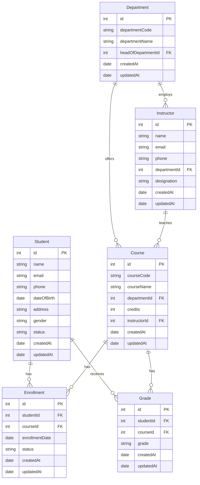

# Student Management System

A comprehensive web-based Student Management System built with Node.js, Express, and MySQL. This system provides a complete solution for managing students, courses, departments, instructors, enrollments, and grades.

## Features

- **Student Management**: Add, view, edit, and delete student records
- **Course Management**: Manage courses, including course codes, names, and credits
- **Department Management**: Organize departments and assign heads of departments
- **Instructor Management**: Track instructor details and their department assignments
- **Enrollment System**: Handle student course enrollments
- **Grade Management**: Record and manage student grades
- **Modern UI**: Responsive design with a clean, user-friendly interface
- **RESTful API**: Well-structured API endpoints for all operations

## Database Structure

The system uses a relational database with the following structure:



## Prerequisites

- Node.js (v14 or higher)
- MySQL (v8.0 or higher)
- npm (Node Package Manager)

## Installation

1. Clone the repository:
   ```bash
   git clone https://github.com/yourusername/Student-Management-System-Using-Nodejs.git
   cd Student-Management-System-Using-Nodejs
   ```

2. Install dependencies:
   ```bash
   npm install
   ```

3. Create a `.env` file in the root directory with the following content:
   ```
   DB_HOST=localhost
   DB_USER=your_mysql_username
   DB_PASSWORD=your_mysql_password
   DB_NAME=student_management_system
   PORT=3000
   ```

4. Create the database:
   ```bash
   mysql -u root -p
   CREATE DATABASE student_management_system;
   ```

5. Run the database migrations:
   ```bash
   npm run migrate
   ```

6. Start the server:
   ```bash
   npm start
   ```

The application will be available at `http://localhost:3000`

## API Endpoints

### Students
- `GET /api/students` - Get all students
- `GET /api/students/:id` - Get a specific student
- `POST /api/students` - Create a new student
- `PUT /api/students/:id` - Update a student
- `DELETE /api/students/:id` - Delete a student

### Courses
- `GET /api/courses` - Get all courses
- `GET /api/courses/:id` - Get a specific course
- `POST /api/courses` - Create a new course
- `PUT /api/courses/:id` - Update a course
- `DELETE /api/courses/:id` - Delete a course

### Departments
- `GET /api/departments` - Get all departments
- `GET /api/departments/:id` - Get a specific department
- `POST /api/departments` - Create a new department
- `PUT /api/departments/:id` - Update a department
- `DELETE /api/departments/:id` - Delete a department

### Enrollments
- `GET /api/enrollments` - Get all enrollments
- `GET /api/enrollments/:id` - Get a specific enrollment
- `POST /api/enrollments` - Create a new enrollment
- `PUT /api/enrollments/:id` - Update an enrollment
- `DELETE /api/enrollments/:id` - Delete an enrollment

### Grades
- `GET /api/grades` - Get all grades
- `GET /api/grades/:id` - Get a specific grade
- `POST /api/grades` - Create a new grade
- `PUT /api/grades/:id` - Update a grade
- `DELETE /api/grades/:id` - Delete a grade

## Testing

To run the test suite:
```bash
npm test
```

## Contributing

1. Fork the repository
2. Create your feature branch (`git checkout -b feature/AmazingFeature`)
3. Commit your changes (`git commit -m 'Add some AmazingFeature'`)
4. Push to the branch (`git push origin feature/AmazingFeature`)
5. Open a Pull Request

## License

This project is licensed under the MIT License - see the [LICENSE](LICENSE) file for details.

## Acknowledgments

- Express.js for the web framework
- Sequelize for the ORM
- MySQL for the database
- All contributors who have helped shape this project


